  

  

  <samp>
    Software engineer focused on high-utility tools, Discord ecosystems, and scalable backend systems.
     I build things that ship. Currently architecting <strong>SimCoin V3</strong> - a full Discord RPG economy.
  </samp>

  
  
  
  

---

<table align="center">
  <tr>
    <td width="50%" align="center">
      <h3>📊 Contribution Graph</h3>
      
    </td>
    <td width="50%" align="center">
      <h3>🔥 Streak Stats</h3>
      
    </td>
  </tr>
</table>

<h3 align="center">🏆 GitHub Trophies</h3>

  

<h3 align="center">📈 Contribution Activity</h3>

  

<table align="center">
  <tr>
    <td width="50%" align="center">
      <h3>💻 Tech Stack</h3>
      
        
      
      
      
      
      
    </td>
    <td width="50%" align="center">
      <h3>🎯 Currently Building</h3>
      

        <strong>🎮 SimCoin V3</strong> 
        <em>Discord economy RPG with 100+ commands</em>
      

      

        <strong>🏗️ Discord Channel Builder</strong> 
        <em>Visual drag-and-drop server architecture</em>
      

      

        <strong>⚡ Stabiliq</strong> 
        <em>Payment infrastructure for developers</em>
      

    </td>
  </tr>
</table>

<h3 align="center">🐍 Contribution Snake</h3>

  <picture>
    <source media="(prefers-color-scheme: dark)" srcset="assets/github-snake-dark.svg" />
    <source media="(prefers-color-scheme: light)" srcset="assets/github-snake.svg" />
    
  </picture>

<!-- WAKATIME -->
<!-- 
<h3 align="center">⏳ Coding Activity</h3>

  

-->

  

  

<!-- HIDDEN METADATA FOR CACHE BUSTING -->
<!-- stats_generated=0 -->
